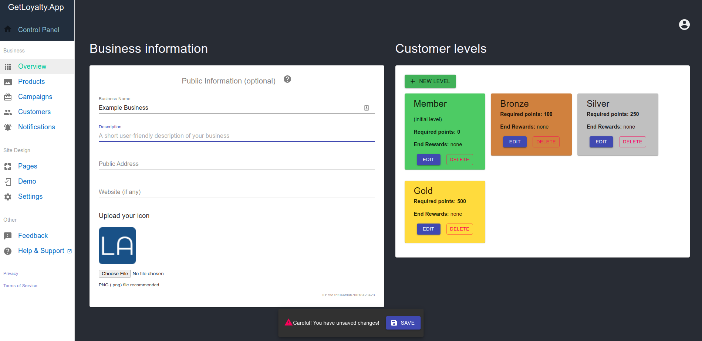
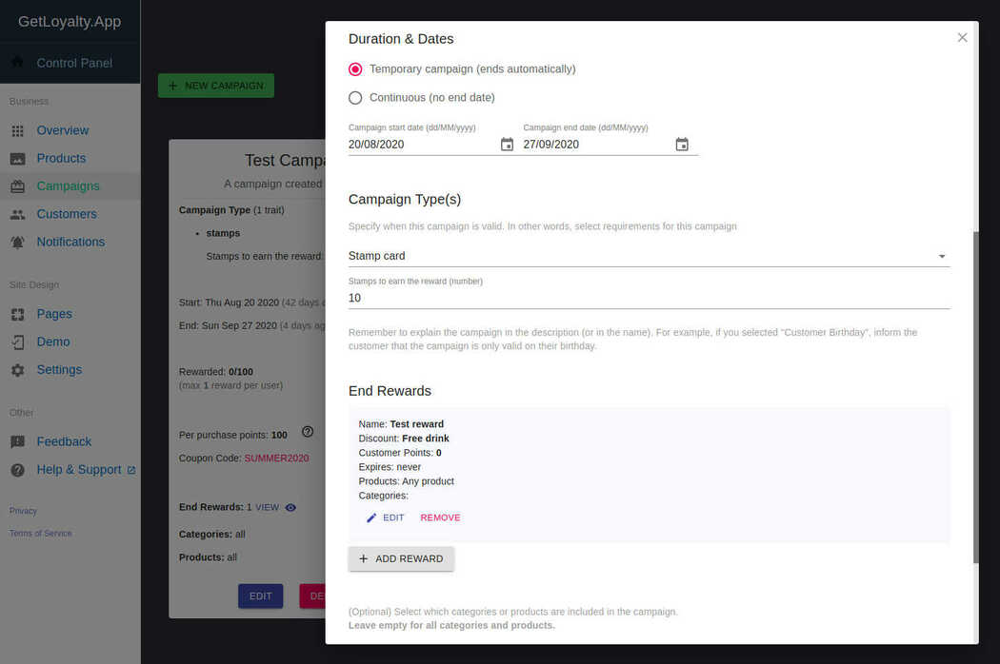
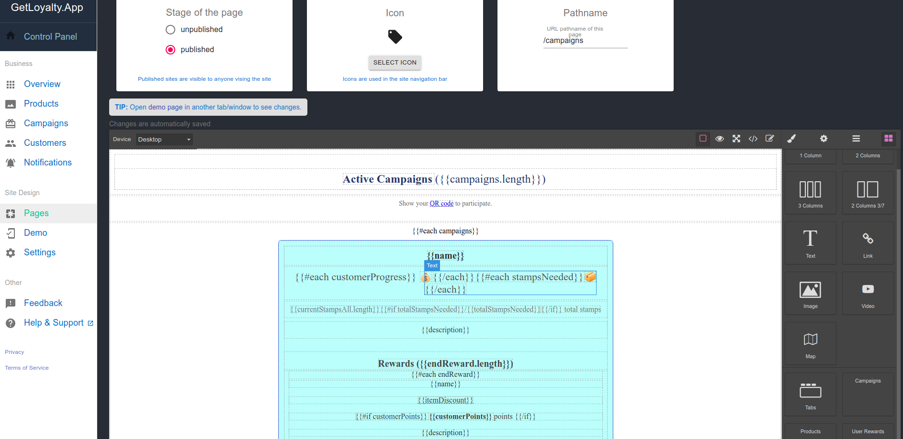
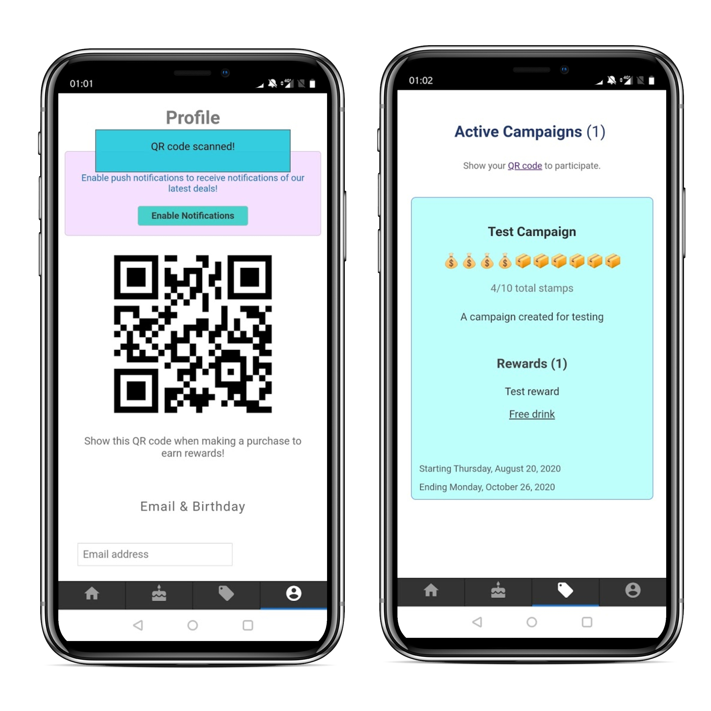
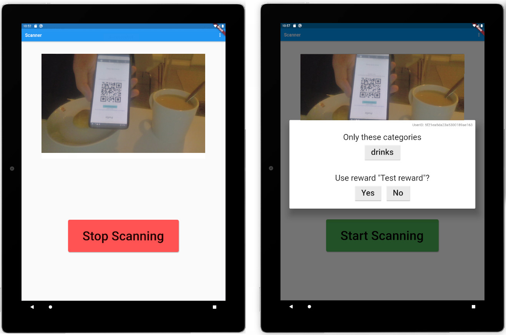

# easy-loyalty-app
Loyalty app setup with (progressive web) app, backend, management panel and a scanner app.

The solution for building versatile loyalty apps easier with a WYSIWYG editor.

This documentation will be updated later. Also, the entire project is still under development.

## Start development
Prerequisites: [docker](https://docs.docker.com/engine/install/) and [docker-compose](https://docs.docker.com/compose/install/)

Run the `start-dev.sh` script to start the development environment.  
You can run each service manually as well. In that case, you must install requirements (such as NPM, Yarn and MongoDB) manually.

## Parts

### loyalty-panel
The control/management panel (https://panel.getloyalty.app). The place where you create the campaigns, pages etc.

Default development port: [3002](http://localhost:3002) 

### loyalty-app
The web app (PWA) the users/customers will use. You can see the pages, on going campaigns, your rewards and more here.

Default development port: [3000](http://localhost:3000) 

## scanner-app
A simple app to scan customer QR codes and confirm purchases and rewards.

### loyalty-backend
The backend of the loyalty app (one per app).

Default development port: [3001](http://localhost:3001) 

See [here](./assets) for more images.